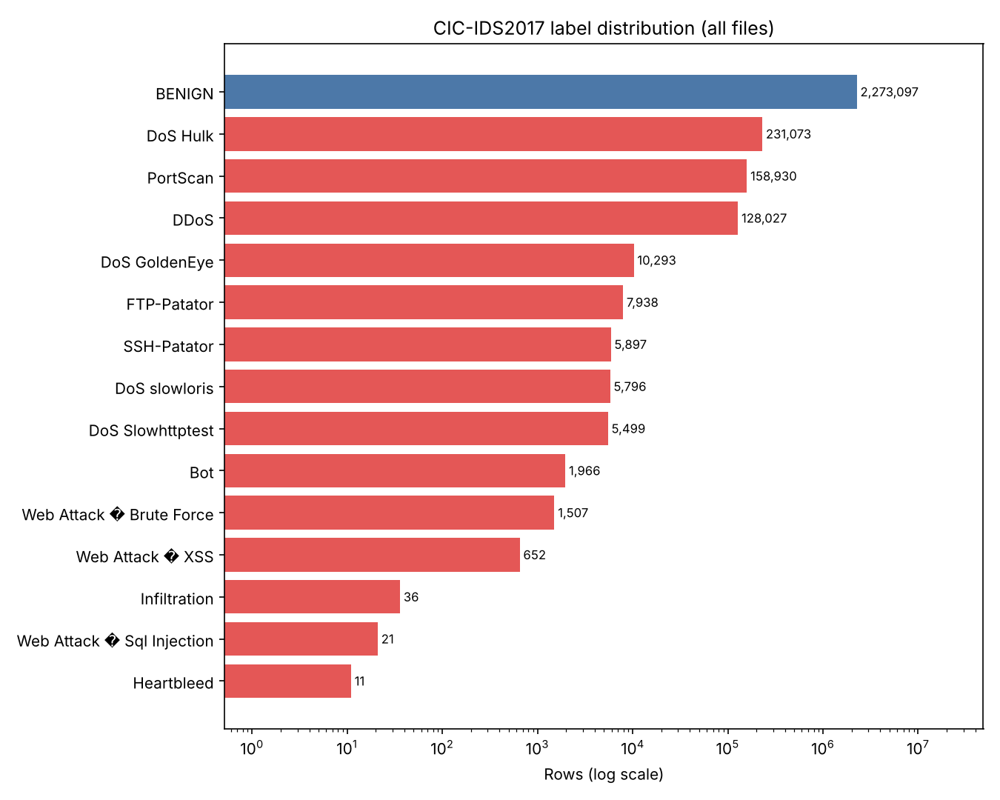
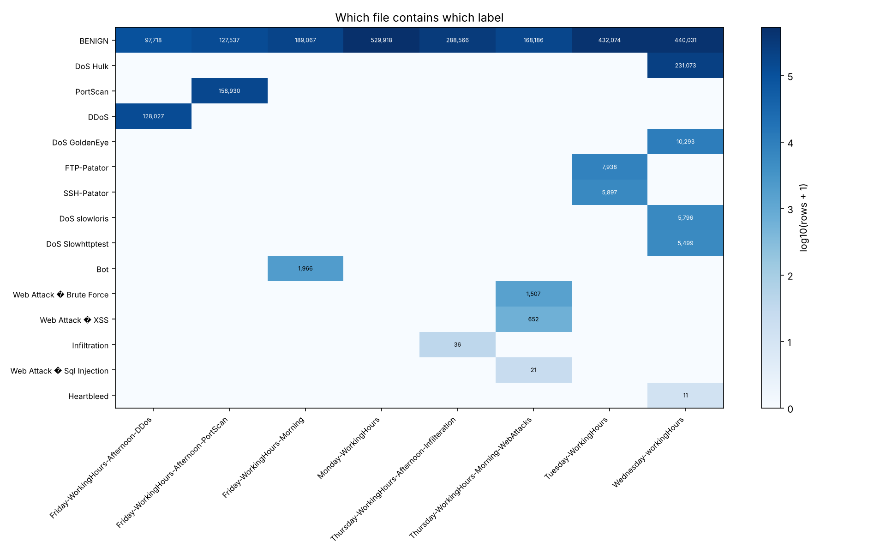
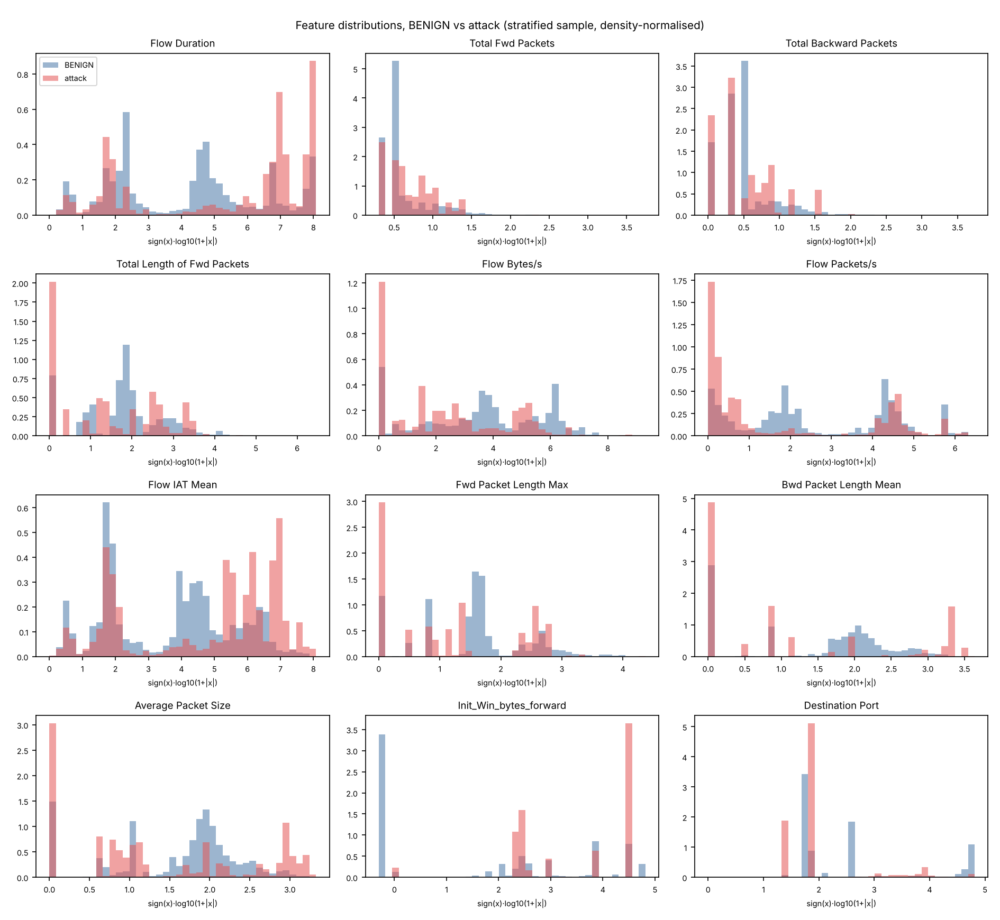
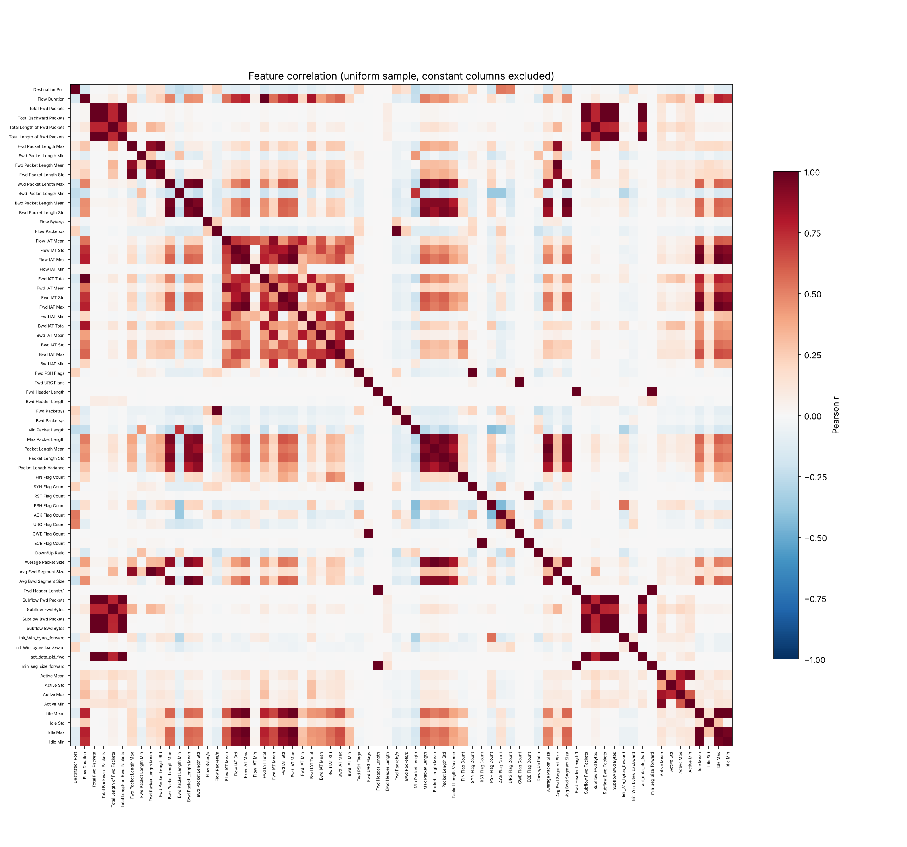

# CIC-IDS2017 dataset inspection

Generated by `python -m src.data.inspect_dataset` and `python -m src.data.eda`. Every number below was measured from the files in `data/raw`; nothing is copied from papers.

## Overview

* Files: **8**
* Rows: **2,830,743**
* Columns: **79** (78 features + `Label`)
* Distinct labels: **15**
* BENIGN rows: **2,273,097** (80.30%); attack rows: **557,646** (19.70%)
* Lines the CSV parser could not read: **0**; completely empty rows: **0**

## Files

| file | encoding | rows | columns | columns_with_whitespace | duplicate_column_names | labels | unparsed_lines |
|---|---|---|---|---|---|---|---|
| Friday-WorkingHours-Afternoon-DDos.pcap_ISCX.csv | utf-8 | 225,745 | 79 | 65 | Fwd Header Length -> Fwd Header Length.1 | 2 | 0 |
| Friday-WorkingHours-Afternoon-PortScan.pcap_ISCX.csv | utf-8 | 286,467 | 79 | 65 | Fwd Header Length -> Fwd Header Length.1 | 2 | 0 |
| Friday-WorkingHours-Morning.pcap_ISCX.csv | utf-8 | 191,033 | 79 | 65 | Fwd Header Length -> Fwd Header Length.1 | 2 | 0 |
| Monday-WorkingHours.pcap_ISCX.csv | utf-8 | 529,918 | 79 | 65 | Fwd Header Length -> Fwd Header Length.1 | 1 | 0 |
| Thursday-WorkingHours-Afternoon-Infilteration.pcap_ISCX.csv | utf-8 | 288,602 | 79 | 65 | Fwd Header Length -> Fwd Header Length.1 | 2 | 0 |
| Thursday-WorkingHours-Morning-WebAttacks.pcap_ISCX.csv | utf-8 | 170,366 | 79 | 65 | Fwd Header Length -> Fwd Header Length.1 | 4 | 0 |
| Tuesday-WorkingHours.pcap_ISCX.csv | utf-8 | 445,909 | 79 | 65 | Fwd Header Length -> Fwd Header Length.1 | 3 | 0 |
| Wednesday-workingHours.pcap_ISCX.csv | utf-8 | 692,703 | 79 | 65 | Fwd Header Length -> Fwd Header Length.1 | 6 | 0 |

Header differences between files: none (all files share the same normalised columns in the same order).

## Labels

| label | total | pct_of_rows |
|---|---|---|
| BENIGN | 2,273,097 | 80.3 |
| DoS Hulk | 231,073 | 8.163 |
| PortScan | 158,930 | 5.614 |
| DDoS | 128,027 | 4.523 |
| DoS GoldenEye | 10,293 | 0.3636 |
| FTP-Patator | 7,938 | 0.2804 |
| SSH-Patator | 5,897 | 0.2083 |
| DoS slowloris | 5,796 | 0.2048 |
| DoS Slowhttptest | 5,499 | 0.1943 |
| Bot | 1,966 | 0.0695 |
| Web Attack � Brute Force | 1,507 | 0.0532 |
| Web Attack � XSS | 652 | 0.023 |
| Infiltration | 36 | 0.0013 |
| Web Attack � Sql Injection | 21 | 0.0007 |
| Heartbleed | 11 | 0.0004 |

Non-ASCII label strings (an encoding artefact to normalise in Phase 2): `'Web Attack � Brute Force'`, `'Web Attack � XSS'`, `'Web Attack � Sql Injection'`

## Missing, infinite and unparseable values

| column | nan | pos_inf | neg_inf | unparseable |
|---|---|---|---|---|
| Flow Bytes/s | 1,358 | 1,509 | 0 | 0 |
| Flow Packets/s | 0 | 2,867 | 0 | 0 |

Per-file counts: `reports/metrics/inspection/nonfinite_by_file.csv`.

## Duplicates

* Redundant copies of exact duplicate rows (features and label equal): **308,381** (10.89% of rows)
  * within the same file: 256,479; across files: 51,902
* Unique feature vectors: 2,521,664
* Feature vectors that appear with more than one label: **698** (covering 7,020 rows)

| label | rows | redundant_copies | redundant_pct |
|---|---|---|---|
| BENIGN | 2,273,097 | 176,613 | 7.77 |
| DoS Hulk | 231,073 | 58,224 | 25.2 |
| PortScan | 158,930 | 68,111 | 42.86 |
| DDoS | 128,027 | 11 | 0.01 |
| DoS GoldenEye | 10,293 | 7 | 0.07 |
| FTP-Patator | 7,938 | 2,005 | 25.26 |
| SSH-Patator | 5,897 | 2,678 | 45.41 |
| DoS slowloris | 5,796 | 411 | 7.09 |
| DoS Slowhttptest | 5,499 | 271 | 4.93 |
| Bot | 1,966 | 13 | 0.66 |
| Web Attack � Brute Force | 1,507 | 37 | 2.46 |
| Web Attack � XSS | 652 | 0 | 0 |
| Infiltration | 36 | 0 | 0 |
| Web Attack � Sql Injection | 21 | 0 | 0 |
| Heartbleed | 11 | 0 | 0 |

Label sets of conflicting vectors (top 10):

| labels | feature_vectors |
|---|---|
| BENIGN \| PortScan | 564 |
| BENIGN \| DoS Hulk | 130 |
| BENIGN \| DDoS | 3 |
| BENIGN \| DoS slowloris | 1 |

## Unusable or redundant columns

* Constant columns (one finite value everywhere): `Bwd PSH Flags`, `Bwd URG Flags`, `Fwd Avg Bytes/Bulk`, `Fwd Avg Packets/Bulk`, `Fwd Avg Bulk Rate`, `Bwd Avg Bytes/Bulk`, `Bwd Avg Packets/Bulk`, `Bwd Avg Bulk Rate`
* Groups of columns with identical contents: `Total Fwd Packets` = `Subflow Fwd Packets`; `Total Backward Packets` = `Subflow Bwd Packets`; `Fwd PSH Flags` = `SYN Flag Count`; `Bwd PSH Flags` = `Bwd URG Flags` = `Fwd Avg Bytes/Bulk` = `Fwd Avg Packets/Bulk` = `Fwd Avg Bulk Rate` = `Bwd Avg Bytes/Bulk` = `Bwd Avg Packets/Bulk` = `Bwd Avg Bulk Rate`; `Fwd URG Flags` = `CWE Flag Count`; `Fwd Header Length` = `Fwd Header Length.1`
* Columns that look like identifiers or context (to decide on in Phase 2): `Destination Port` (port)

## Numeric summaries

Full table: `reports/metrics/inspection/column_stats.csv` (finite values only for mean/std/min/max).

| column | mean | std | min | max | zeros | negatives |
|---|---|---|---|---|---|---|
| Flow Duration | 1.479e+07 | 3.365e+07 | -13 | 1.2e+08 | 2,867 | 115 |
| Total Fwd Packets | 9.361 | 749.7 | 1 | 2.198e+05 | 0 | 0 |
| Total Backward Packets | 10.39 | 997.4 | 0 | 2.919e+05 | 453,519 | 0 |
| Total Length of Fwd Packets | 549.3 | 9,994 | 0 | 1.29e+07 | 449,170 | 0 |
| Flow Bytes/s | 1.492e+06 | 2.594e+07 | -2.61e+08 | 2.071e+09 | 355,767 | 85 |
| Flow Packets/s | 7.085e+04 | 2.544e+05 | -2e+06 | 4e+06 | 0 | 115 |
| Flow IAT Mean | 1.298e+06 | 4.508e+06 | -13 | 1.2e+08 | 2,867 | 115 |
| Fwd Packet Length Max | 207.6 | 717.2 | 0 | 2.482e+04 | 449,170 | 0 |
| Bwd Packet Length Mean | 305.9 | 605.3 | 0 | 5,800 | 707,746 | 0 |
| Average Packet Size | 192 | 331.9 | 0 | 3,893 | 357,125 | 0 |
| Init_Win_bytes_forward | 6,990 | 1.434e+04 | -1 | 6.554e+04 | 99,771 | 1,001,189 |
| Destination Port | 8,071 | 1.828e+04 | 0 | 6.554e+04 | 1,696 | 0 |

## Correlation

Pearson correlation on a uniform random sample of 100,000 rows, with infinities treated as missing. Pairs with |r| >= 0.95: **47**.

| feature_a | feature_b | pearson_r |
|---|---|---|
| Total Fwd Packets | Subflow Fwd Packets | 1 |
| Total Length of Fwd Packets | Subflow Fwd Bytes | 1 |
| Total Backward Packets | Subflow Bwd Packets | 1 |
| Fwd URG Flags | CWE Flag Count | 1 |
| Fwd PSH Flags | SYN Flag Count | 1 |
| Bwd Packet Length Mean | Avg Bwd Segment Size | 1 |
| Fwd Packet Length Mean | Avg Fwd Segment Size | 1 |
| RST Flag Count | ECE Flag Count | 1 |
| Fwd Header Length | Fwd Header Length.1 | 1 |
| Total Length of Bwd Packets | Subflow Bwd Bytes | 1 |
| Subflow Fwd Packets | Subflow Bwd Packets | 0.9996 |
| Total Fwd Packets | Subflow Bwd Packets | 0.9996 |
| Total Backward Packets | Subflow Fwd Packets | 0.9996 |
| Total Fwd Packets | Total Backward Packets | 0.9996 |
| Total Backward Packets | act_data_pkt_fwd | 0.9988 |
| Subflow Bwd Packets | act_data_pkt_fwd | 0.9988 |
| Subflow Fwd Packets | act_data_pkt_fwd | 0.9986 |
| Total Fwd Packets | act_data_pkt_fwd | 0.9986 |
| Flow Duration | Fwd IAT Total | 0.9985 |
| Flow IAT Max | Fwd IAT Max | 0.9979 |
| Packet Length Mean | Average Packet Size | 0.9978 |
| Total Length of Bwd Packets | act_data_pkt_fwd | 0.9974 |
| Subflow Bwd Bytes | act_data_pkt_fwd | 0.9974 |
| Total Fwd Packets | Total Length of Bwd Packets | 0.9973 |
| Total Length of Bwd Packets | Subflow Fwd Packets | 0.9973 |

## Sampling notes

* Distribution plots use a stratified sample of up to 5,000 rows per label (49,193 rows). It shows rare attacks but does not reflect real class proportions.
* Correlations use a uniform sample of 100,000 rows, which keeps the real class mix. Very rare labels therefore barely influence it.
* Both samples are exact uniform draws (bottom-k sampling, seed 42); all counts above (rows, labels, missing values, duplicates) use every row, not a sample.
